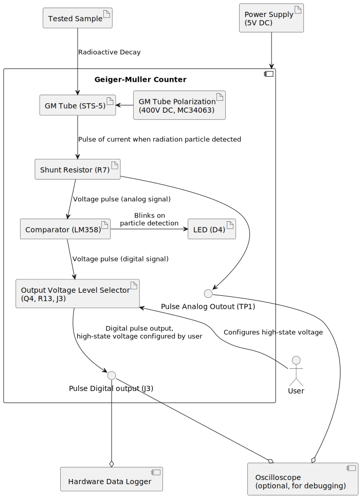

# GeigerMullerCounter

## Purpose

The Geiger–Müller counter is a simple, reliable tool designed to measure ionizing radiation. It is widely used in experiments, radiation detection, and environmental monitoring.

## Principle of Operation
When a high voltage (typically 380–420V) is applied to the Geiger–Müller tube, the tube does not conduct electricity under normal conditions. However, when a radiation particle interacts with the tube, it briefly conducts a current, producing a pulse. These pulses are counted by the detector, and the number of pulses in a given time interval (typically 20 seconds to 2.5 minutes) is proportional to the level of ionizing radiation.

## Final Version
Below is an image of the device (the green PCB in the center). Other components in the image are not relevant to this project, as they belong to the [Cosmic Ray Detector](https://github.com/RobertGawron/CosmicRayDetector), where the Geiger counter is used as a building block.

## System Architecture

The diagram shows the main components and how they interact. The component IDs in parentheses match those in the circuit diagram below, making it easier to understand the circuit.

Tools: PlantUML

## Hardware 

The circuit is shown below. For a full-size image, right-click and open it in a new tab.

Tools: KiCad (for PCB design).

More info can be fond in [here](Hardware/GeigerMullerCounter/README.md).

## Software

Data from the Geiger–Müller counter is collected and managed using the [HardwareDataLogger](https://github.com/RobertGawron/HardwareDataLogger), which is built around an STM32 microcontroller for data collection, display, and storage (via SD card), and an ESP8266 for WiFi communication.

Tools: C++, Python.

## Experiments Conducted

* [Measuring Nuclear Radiation of Potassium from Cigarette Ashes](https://robertgawron.blogspot.com/2015/07/measuring-radioactivity-of-potassium.html): Cigarette ashes are the burnt remains of tobacco leaves, which are rich in potassium. In natural environments, potassium contains the radioactive isotope potassium-40 (K-40), which contributes to the measured radiation levels.
* [Cosmic Ray Detector](https://github.com/RobertGawron/CosmicRayDetector): a device designed to detect high-energy particles, known as cosmic rays, that originate from outer space.
* [Trip to Śnieżka mountain to measure radioactivity levels](https://robertgawron.blogspot.com/2015/06/a-trip-with-geiger-counter-on-sniezka.html): mountains naturally have elevated radiation levels due to increased cosmic rays and radioactive minerals in the rocks. Additionally, near Śnieżka Mountain, a Cold War-era uranium mine in Kowary contributed to the region's historical radiation levels.

## Safety Hazards

**Warning: The device operates at high voltage (380–420V). Contact with the PCB or Geiger tube while powered can cause electric shocks, injuries, or even death. Do not touch any components while the device is powered on.**

## License
This project is licensed under the MIT License. See the [LICENSE](./LICENSE) file for details.
